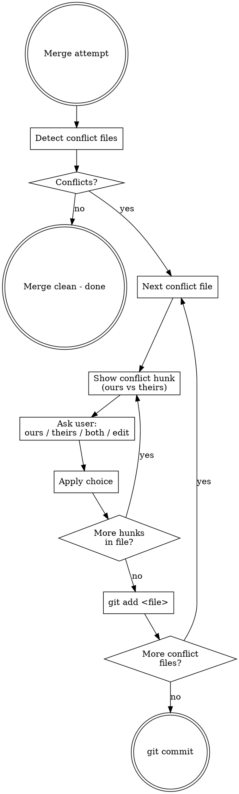

# Merge Resolve

Interactive conflict resolution for PR merges and branch merges.
Each conflict is presented one at a time. The user decides. No auto-resolution.

## Trigger

This skill activates when:
- `git merge` produces conflicts
- `gh pr merge` fails due to conflicts
- User says "merge", "resolve conflicts", or "PR merge"

## Workflow



## Steps

### 1. Attempt Merge

```bash
# PR merge (local)
git fetch origin
git merge origin/<base-branch>

# Or via gh
gh pr merge <number> --merge
```

If no conflicts, done. If conflicts exist, continue.

### 2. List Conflict Files

```bash
git diff --name-only --diff-filter=U
```

Report to user:

> **N개 파일에서 충돌 발생:**
> 1. `path/to/file1.ts`
> 2. `path/to/file2.py`
>
> 하나씩 해결하겠습니다.

### 3. For Each File, For Each Hunk

Read the file. Find each `<<<<<<<` ... `=======` ... `>>>>>>>` block.

Present ONE hunk at a time:

> **파일: `src/config.ts` (충돌 1/3)**
>
> **Ours (현재 브랜치):**
> ```ts
> const timeout = 3000;
> ```
>
> **Theirs (머지 대상):**
> ```ts
> const timeout = 5000;
> ```
>
> 선택: **ours** / **theirs** / **both** / **edit**

### 4. Apply User Choice

| Choice | Action |
|--------|--------|
| **ours** | Keep current branch version |
| **theirs** | Keep incoming version |
| **both** | Keep both (ours first, then theirs) |
| **edit** | Ask user for exact replacement text |

Apply the choice using Edit tool, removing conflict markers.

### 5. Stage and Continue

After all hunks in a file are resolved:
```bash
git add <file>
```

Move to next conflict file. Repeat until all resolved.

### 6. Complete Merge

```bash
git commit --no-edit
```

Report:

> **모든 충돌 해결 완료.** N개 파일 수정, merge commit 생성됨.

## Rules

- **Never auto-resolve.** Every conflict hunk requires user input.
- **One hunk at a time.** Do not batch multiple hunks in one question.
- **Show both sides clearly.** Use code blocks with syntax highlighting.
- **Preserve context.** Show 2-3 lines above/below the conflict for orientation.
- **Korean prompts.** User-facing messages in Korean, code/filenames in English.
